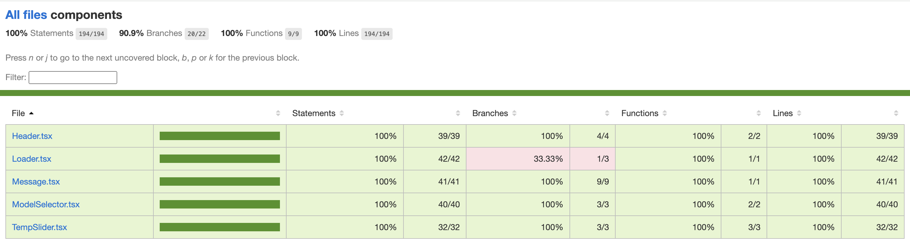
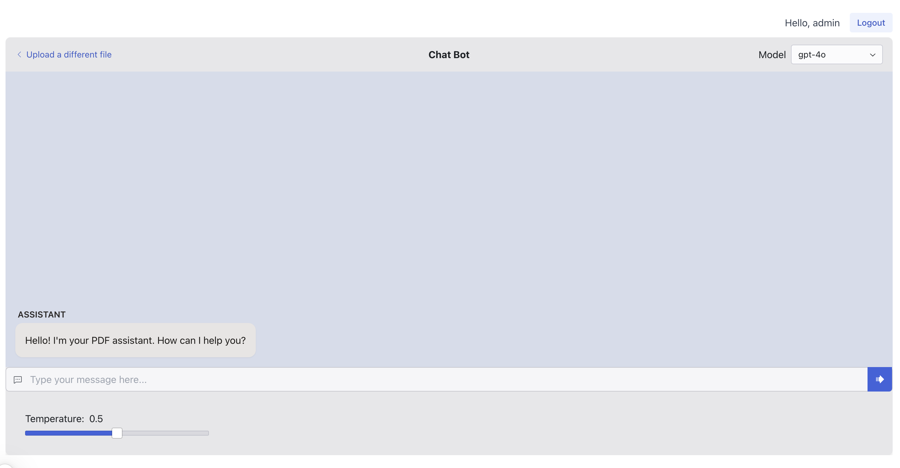

## My Chatbot App

This app allows you to upload your PDF file and engage in an interactive conversation with the content of the file through a chatbot.

### Features:
 1. Allow users to upload PDF files (currently restricted to PDFs only; future updates will support multiple file formats).
 1. Initiate a conversation with the bot to explore and discuss the contents of the uploaded PDF, with the bot answering questions or providing insights based on the document's information (ToDO).
 1. Switch between different models during the conversation for varied responses and capabilities.
 1. Adjust the temperature setting during the conversation to fine-tune the bot's responses for more accurate outputs.
 1. Authentication for login is implemented using JSON Web Tokens (JWT).

### Core Stack:
| Major Stack   | Version                                                                                                    |
|:---------------------|:-----------------------------------------------------------------------------------------------------------------|
| Node        | 20.17.9                      |
| React           | 18.3.1 |
| Next              | 15.0.3|
| TypeScript      | 5.0.0|
| Tailwind CSS         | 3.4.1|
| es-Lint           | 8.0.0 |
| testing-library           | 16.0.1 |
| Jest          | 29.7.0 |


### Packages Detail:
| Incorporated 3rd party packages    | Use of Third-Party Packages                                                                                                    |
|:---------------------|:-----------------------------------------------------------------------------------------------------------------|
| ai-sdk/openai        | The OpenAI provider on Vercel allows you to create a function that invokes a language model.                      |
| @radix-ui            | Integrated Radix UI components to enhance the user interface like `Theme`, `TextField`, `Flex`, `Select` and `Slide` components in our app |
| AI SDK               | AI SDK is a typescript toolkit, used `UseChat` hook to create a conversational user interface for chatbot app and `streamText` helps to persistent chat history storage. |
| LlamaIndex.TS        | The llamaIndex package facilitates creating a vector index with a data store and index store in JSON format using built-in functions like `VectorStoreIndex`, `serviceContextFromDefaults`, and `storageContextFromDefaults`.  |
| @cyber2024/pdf-parse-fixed | The PDF parsing library enables understanding and extracting text content from PDF files to generate a JSON data store, structured according to the index created by llamaIndex. |
| react-dropzone       | React Dropzone package to enable a seamless drag-and-drop file upload feature in our app.|
| react-icons          | Utilized React Icons to incorporate a wide range of icons throughout our app.|
| Classnames           | `cn` utility function (often part of a utility library like classnames or a custom implementation) to handle conditional class application, merge multiple classes, and clean up the code in our app. |


### Way to run locally

```bash
Install dependencies : npm install / npm i
Start Dev : npm run dev
Run lint : npm run lint
Run Test : npm run test
Check Coverage : npm run test:coverage
```

Open [http://localhost:3000](http://localhost:3000) with your browser to see the app.

#### Login with this credetials
_username_: `admin`\
_password_: `nmtest`

### Unit Testing
Unit testing is implemented using the Jest testing library. The testing effort achieved over 75% code coverage across the entire application, ensuring the reliability of core functionality. Additionally, 100% test coverage was achieved for all UI components, thoroughly verifying their behavior and interactions.

#### Tests:


#### Test Coverage


### Demo Videos

#### App Overview
https://github.com/user-attachments/assets/9756bf6f-cc04-4001-a662-d0f5a9782d36

#### App Demo
https://github.com/user-attachments/assets/aa20e0fc-ba8d-4d68-9a42-11832ba24e7b


### Application Screenshots

#### Login Page


#### Upload Page


#### Upload Page with file selected


#### Loading


#### Chat Interface


